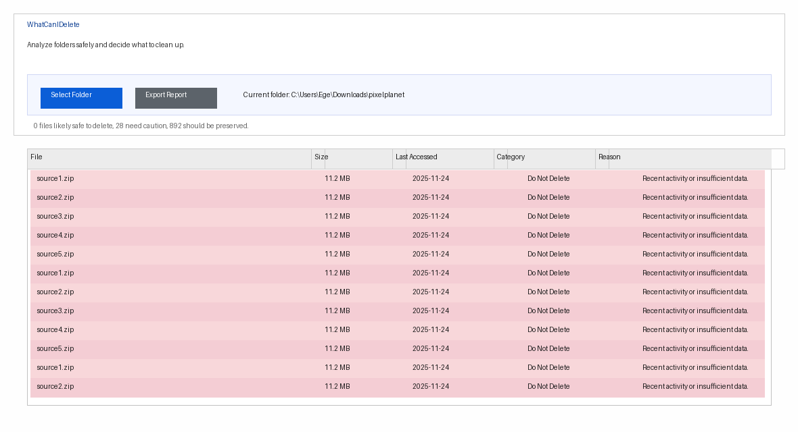

# WhatCanIDelete
A lightweight desktop helper that inspects folders and surfaces files you might delete *after you review them*. The tool never alters anything?it only suggests categories so you keep control.

## Features
- Pick any folder and scan every file with metadata (size, last modified/accessed, extension).
- Categorize entries into **Likely Safe to Delete**, **Be Careful**, or **Do Not Delete** based on age, size, extension, and duplicate names.
- Interactive summary plus color-coded table so you can spot large unused items at a glance.
- Export the current analysis as `.csv`/`.txt` for offline review or sharing with teammates.

## Screenshot


## Getting started
1. Open the `WhatCanIDelete.csproj` with Visual Studio or run `dotnet run` from the project folder.
2. Tap **Select Folder** to choose a directory; the scan runs asynchronously and the grid populates automatically.
3. Use the **Export Report** button after a scan if you want a CSV/TXT snapshot of the results.
4. Make your own decision?this app never deletes anything for you.

## Heuristics
- Files with temporary/cache extensions (.tmp, .log, .bak, etc.) are marked as **Likely Safe to Delete**.
- Items untouched for over a year are usually **Likely Safe**; large files untouched for six months fall into **Be Careful**.
- The most recent version of duplicate file names stays protected while older copies are flagged with caution.

## Build/Publish
```bash
dotnet build
# for a standalone executable
dotnet publish -c Release -o publish
```

## License
Please see the accompanying `LICENSE` for usage rules. The project is not open-source?unauthorized copying or redistribution is prohibited.
